Copyright Lab Assignment

Security, Privacy, and Consumer Protection

Grace Harrell -- CNETID: gkharrell

**Platform Analysis: YouTube**

**How does the platform detect copyrighted content?**

YouTube employs Content ID, one of the industry\'s most sophisticated
copyright detection systems, which automatically scans every uploaded
video against a database of copyrighted audio and visual content using
digital fingerprinting technology that can identify matches within
seconds of upload. Content ID identifies matches by comparing uploaded
videos to files submitted by copyright owners, and when a match is
found, the video receives a Content ID claim. Content ID creates unique
ID files for copyrighted material and checks uploaded videos against
this database, flagging copyright violations when matches are found. The
detection system scans more than 500 hours of video uploaded to YouTube
every minute, and can identify copyrighted material even when partially
obscured or modified.

Sources: YouTube Help -
[[https://support.google.com/youtube/answer/2797370]{.underline}](https://support.google.com/youtube/answer/2797370)
, Wikipedia -
[[https://en.wikipedia.org/wiki/Content_ID]{.underline}](https://en.wikipedia.org/wiki/Content_ID)

**What happens when content is flagged as potentially infringing?**

When content is flagged on YouTube, the outcome depends on whether it
triggers a Content ID claim or a formal copyright strike. Content ID
claims allow copyright holders to monetize videos, block them, or track
viewership without immediate removal, whereas strikes result in video
removal and potential channel termination. When a channel receives a
copyright strike, YouTube removes the content immediately and requires
the creator to complete Copyright School. The platform employs a
three-strike system where three copyright strikes within 90 days result
in channel termination, removal of all videos, and prohibition from
creating new channels.

For Content ID claims, copyright holders can choose to monetize the
video by placing ads and collecting revenue, block it in specific
regions or worldwide, or simply track its statistics, while the video
often remains accessible on the platform. Videos with active Content ID
claims may have their audio muted, geographic availability limited, or
monetization redirected to the copyright holder, and creators receive
detailed information about which copyrighted material was detected and
who owns it.

Sources: YouTube Help -
[[https://support.google.com/youtube/answer/2814000]{.underline}](https://support.google.com/youtube/answer/2814000), Lexology -
[[https://www.lexology.com/library/detail.aspx?g=c02eea35-a82e-42b4-bb03-a1c9da9a2302]{.underline}](https://www.lexology.com/library/detail.aspx?g=c02eea35-a82e-42b4-bb03-a1c9da9a2302)

**What is the appeals or counter-notification process?**

YouTube provides a multi-tiered dispute resolution system that differs
significantly between Content ID claims and formal copyright strikes.
For Content ID claims, creators can dispute directly and after
submission, has 30 days to respond by either releasing the claim,
rejecting the dispute, or allowing it to expire. If a dispute is
rejected, creators can appeal the decision, giving the claimant 7 days
to respond, and if the claimant rejects the appeal they must submit a
formal copyright removal request which results in a strike. YouTube also
offers an \"Escalate to Appeal\" option for blocked videos, which skips
the initial 30-day dispute period and moves directly to the 7-day appeal
process for faster resolution. For formal copyright strikes, creators
must submit a counter-notification that includes their contact
information, a statement under penalty of perjury that the removal was a
mistake, consent to US federal court jurisdiction, and their signature.
After YouTube forwards the counter-notification to the claimant, they
have 10 US business days to provide evidence of legal action against the
uploader, and if they fail to respond, the content may be reinstated.
Creators can also request retractions by contacting copyright holders
directly or wait for strikes to expire after 90 days upon completing
Copyright School, though YouTube warns that repeated abuse of the
dispute process can result in loss of appeal eligibility or other
penalties.

Sources: YouTube Help - [[https://support.google.com/youtube/answer/2797454]{.underline}](https://support.google.com/youtube/answer/2797454),
YouTube Help - [[https://support.google.com/youtube/answer/12104471]{.underline}](https://support.google.com/youtube/answer/12104471)

**How does the platform handle monetization of content containing
copyrighted material?**

YouTube\'s approach to monetizing copyrighted content is uniquely
flexible through Content ID, allowing copyright holders to choose
whether to monetize, block, or track videos containing their material
rather than automatically removing them. Copyright owners can monetize
content by running ads and sometimes sharing revenue with the uploader,
block content from being viewed, or track viewership statistics, with
these actions potentially varying by geographic region. When copyright
holders choose monetization, all advertising revenue from the video is
paid to the rights holder rather than the creator, though the video
continues to display ads to viewers, and creators in the YouTube Partner
Program may be able to share revenue with music publishers depending on
the copyright owner\'s settings. During Content ID disputes, if both the
creator and claimant want to monetize the video, ads continue running
and revenue is held separately, with earnings paid to the appropriate
party once the dispute resolves. Videos with active Content ID claims
face several monetization restrictions: watch time from claimed videos
generally does not count toward the 4,000 hours required to join the
YouTube Partner Program, and creators lose the ability to earn revenue
from those specific videos even though the videos may remain accessible
on the platform. Formal copyright strikes have more severe consequences,
immediately removing videos and restricting the creator\'s monetization
privileges entirely, with multiple strikes leading to complete loss of
YouTube Partner Program eligibility and potential channel termination.

Sources: YouTube Help -
[[https://support.google.com/youtube/answer/7000961]{.underline}](https://support.google.com/youtube/answer/7000961)
, YouTube Help -
[[https://support.google.com/youtube/answer/6013276]{.underline}](https://support.google.com/youtube/answer/6013276)

**Are there any special programs (e.g., YouTube\'s Content ID licensing
agreements)?**

YouTube\'s Content ID system functions as a comprehensive special
program with strict eligibility requirements that limit direct access
primarily to major copyright holders while allowing independent artists
to participate through music distributors. Copyright owners must provide
evidence of exclusive rights to copyrighted content, and Content ID
matches reference material against every YouTube upload, with owners
required to demonstrate exclusive rights rather than non-exclusive
licenses. Most independent musicians access Content ID through
distribution services, which serve as intermediaries by uploading music
to YouTube Music and registering tracks in the Content ID database on
artists\' behalf. Eligibility requirements exclude numerous content
types: cover songs regardless of licensing, public domain compositions,
content with non-exclusive third-party licenses, samples from audio
libraries or production loops, Creative Commons licensed material, video
game soundtracks unless submitted by publishers, and AI-generated
content.

Sources: YouTube Help -
[[https://support.google.com/youtube/answer/1311402]{.underline}](https://support.google.com/youtube/answer/1311402)
, Loop Fans -
[[https://music.loop.fans/blog/youtube-content-id-music-distribution]{.underline}](https://music.loop.fans/blog/youtube-content-id-music-distribution)

**Fair Use Experiments:**

Documentation of successful upload for all 5 experiments:

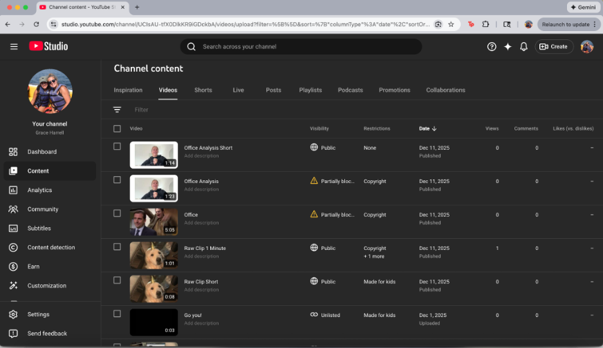

**Experiment 1: Raw Copyrighted Clip**

I uploaded a photo of my dog in a birthday hat (an image I know wouldnt
be copyrighted), and put a copyrighted song ("Dancing in the Dark") as
the audio using Canva.com, for two various lengths - 8 seconds and over
a minute. When processing and uploading the "Raw Clip Short" video, I
encountered the screens, with the automatic copyright check by Content
ID approving the video with the 8 seconds of the copyrighted audio
playing with no channel or visibility limitations.
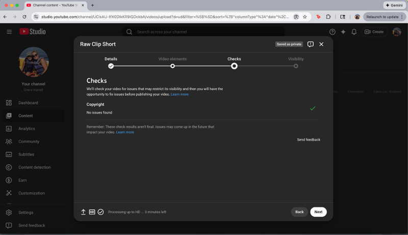

However, with the "Raw Clip 1 Minute," with the audio playing for over 1
minute, I received the following checks and limitations.

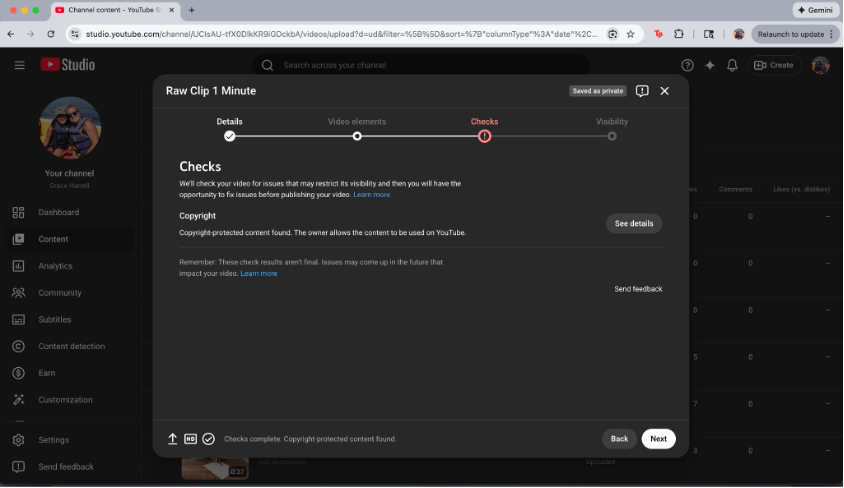

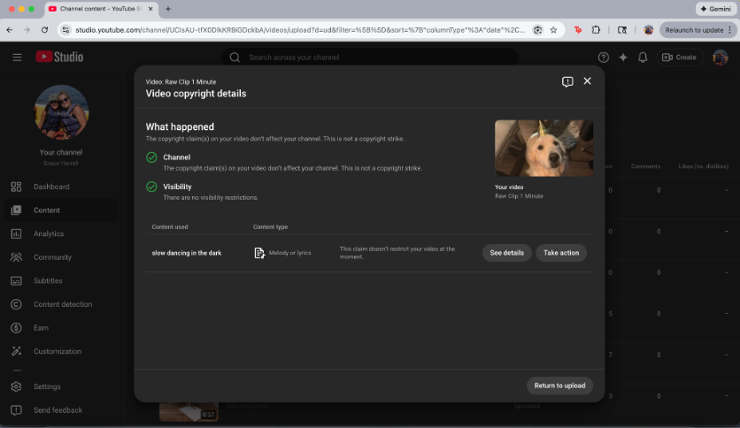

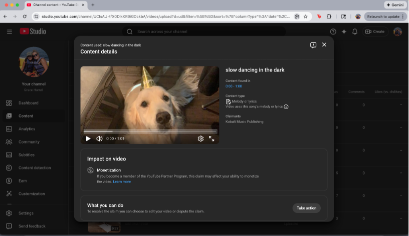

Based on the author of the song (Joji), Youtube showed that he limited
the monetization of his songs, but allows for them to be used and
uploaded, so if I wanted to make money from a video featuring this song,
I wouldnt be able to do it immediately upon processing of the video and
before upload.

With this notification, I have the ability to "Take Action," which give
me the options below to "erase" or "replace" the song, or I can dispute
the claim, which can take up to 30 days.

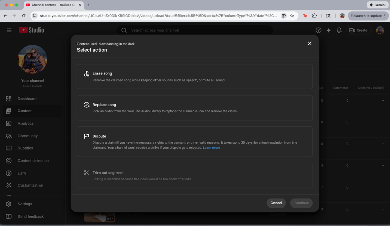

**Experiment 2: Commentary / Criticism**

For the second experiment, I explored the commentary and criticism
aspect of copyright laws by uploading my own "review" of an episode of
The Office. I first uploaded a raw 5 minute clip of the episode just to
see what the copyright for videos looked like, in the screenshots below.
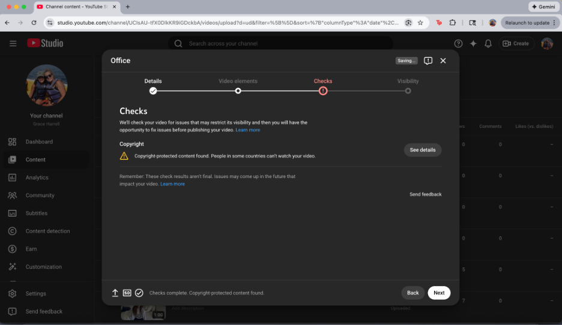
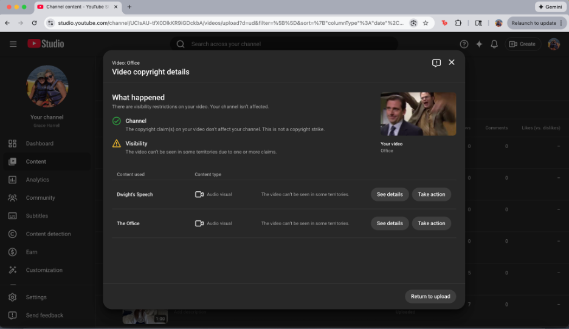
The screenshot above shows the two separate
copyright laws that were violated in the 5 minute video, and clicking
into them, it shows the exact time ranges specified that are violating.
These violations not only limit monetization, but also visibility based
on geographical location.
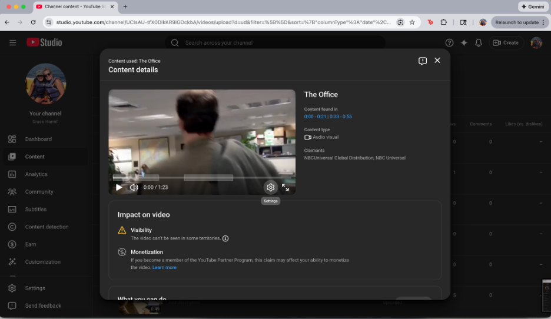

With this, I added in my commentary clips in between portions of the
clips to provide "Analysis," which still triggered the copyright laws as
below, but only one violation now. These still gave me the same options
as experiment 1 to replace, erase, or dispute the portion of video if I
wanted it to be visible to every user, as opposed to limited by
geographical location.

To see if I could get around the copyright check, I chopped up the clips
a little more with more analysis in between and made it a bit shorter,
which passed the Content ID check, pictured below. I was then able to
upload freely.

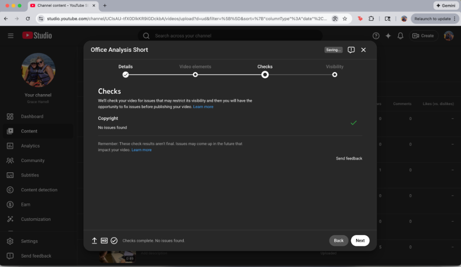

**AI Content Investigation:**

I first wanted to make an audio that sounded like Adele, but ChatGPT was
not compliant with that at all. I gave it the prompt to 'Generate music
in the style of Adele" with the follow up prompt to "Please create one
with lyrics and one that sounds like Adele." I was surprised to find
that there was no way to prompt it to get an audible woman's voice,
because the .wav file it created after was simply instrumental. This
represents a copyright and likeness safeguard at the generation level.
While style inspiration is permitted in an abstract sense, the AI did
not generate a vocal performance resembling Adele, likely to avoid
issues related to voice imitation and artist identity.

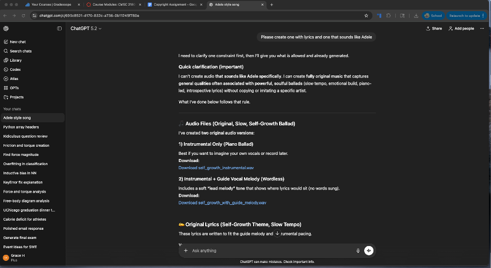

I still put it over a still white background and uploaded it, to which
it received no copyright issues.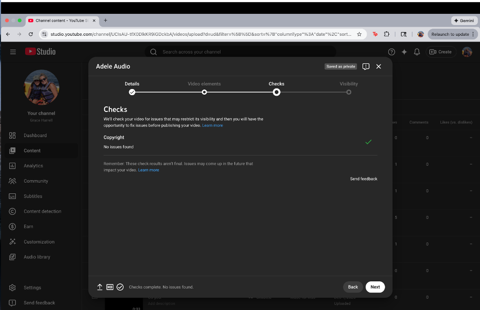I then looked to create images. I prompted
"Generate a photo of Elmo," which was denied as a result of the content
rules, as pictured below. The platform prevented generation of a direct
depiction, demonstrating enforcement of intellectual property
protections for well-known fictional characters.

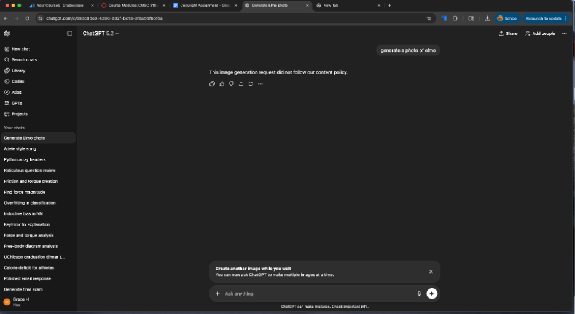

I then looked to use a "style" in photo generation, with "Generate a
photo of a girl in the style of South Park with brown hair and glasses,"
which created a pretty good image in my opinion.

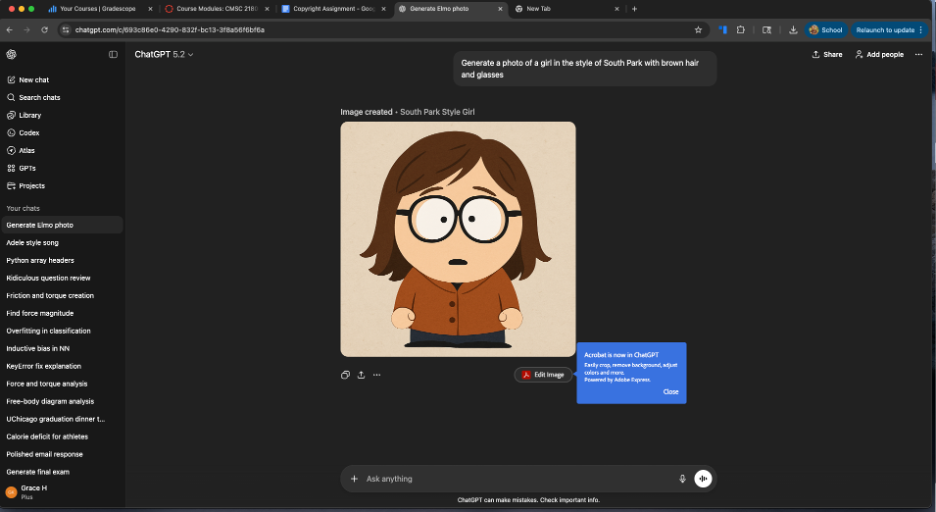

Finally, with content generated by AI, I made it into a video and
uploaded it. The video uploaded with no issues or copyright flags. This
request was permitted because it referenced a style, not a specific
character. The output was sufficiently transformative and original,
aligning with platform rules that allow stylistic inspiration without
direct copying.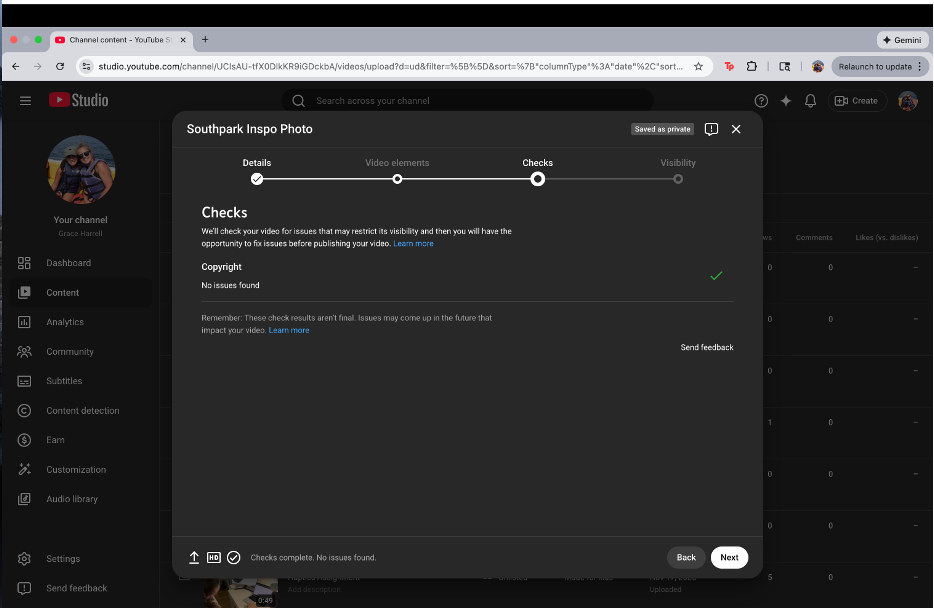

Based on YouTube's stated copyright and AI content policies, the
platform places responsibility on the uploader to ensure that content
does not infringe on copyright or violate impersonation rules. YouTube
does not automatically block or label AI-generated content, but it
evaluates it under the same standards as traditional user-generated
media. This directly aligns with my experiment: once I uploaded a video
made from original AI-generated imagery, it was allowed on the platform
with no copyright flags or restrictions, indicating that YouTube treats
compliant AI content as acceptable original content.

In terms of ownership, YouTube does not claim copyright over
AI-generated uploads and neither does OpenAI. In this case, I am
considered the owner of the AI-generated image to the extent that
copyright exists, so more broadly, the uploader is treated as the rights
holder to the extent that copyright exists, though YouTube acknowledges
that AI-generated content may fall into a legal gray area under U.S. law
if it lacks sufficient human creative input. This means that while I was
able to upload and share the AI-generated video without issue, my
ability to claim exclusive ownership over it may be limited. In
practice, YouTube allows the content to exist and circulate as long as
it does not violate copyright or community guidelines. Content that
closely imitates real people or copyrighted characters, such as
generating a recognizable artist's voice or a character like Elmo,
raises risks related to copyright, impersonation, and misleading
content. By contrast, my final upload avoided those issues by using
original visuals inspired by a general style rather than a specific
copyrighted entity. As a result, the content passed YouTube's checks and
was treated no differently than any other original video.

**Legal Analysis:**

Across my fair use experiments, the four-factor analysis explains why
some uploads were allowed while others were restricted. In Experiment 1,
where I used a copyrighted song over a photo of my dog, the purpose and
character of the use was largely non-transformative: the song was used
as background audio rather than for commentary or critique. Even though
the video itself was not commercial, the lack of transformation weighed
against fair use. The amount used was especially determinative in
practice: an 8-second clip passed Content ID with no restrictions, while
a clip over one minute triggered monetization limits. Finally, the
effect on the market factor was reflected directly in YouTube's
enforcement because the rights holder had monetization enabled, YouTube
diverted or restricted revenue rather than removing the video entirely.
This shows how YouTube operationalizes market harm through Content ID
rather than through a strict fair use determination.

Experiment 2 aligns much more closely with classic fair use doctrine.
Once I added commentary and critique to clips from The Office, the
purpose and character of the use became clearly transformative, shifting
from pure reuse to analysis. This mirrors cases like Campbell v.
Acuff-Rose, where commentary and criticism strongly favored fair use,
and Google v. Oracle, which emphasized transformative purpose over the
mere presence of copyrighted material. However, YouTube's enforcement
revealed that transformation alone is not always sufficient in practice.
Longer or less-edited clips still triggered Content ID claims,
suggesting that the amount and substantiality factor plays an outsized
role on the platform. Only when I further reduced and fragmented the
clips did the video pass automated checks entirely. This shows that
while fair use may apply legally, creators often have to over-comply
with platform standards to avoid automated enforcement.

The AI experiments highlight a broader gap between legal theory,
platform policy, and real-world enforcement. From a copyright law
perspective, AI-generated content that does not copy protected
expression should not infringe at all, making fair use largely
irrelevant. In practice, however, both OpenAI and YouTube act
conservatively. OpenAI blocked generation of content that closely
resembled Adele's voice or a copyrighted character like Elmo at the
generation stage, while YouTube evaluated the final AI-generated video
under the same Content ID framework as any other upload. This reveals a
key gap: copyright law focuses on infringement and fair use, while
platform policy prioritizes risk avoidance and automation. As a result,
enforcement often occurs before legal questions like fair use are fully
implicated. My experiments show that creators must navigate not just
copyright law, but also platform-specific thresholds that are stricter,
more automated, and less context-sensitive than the doctrine itself.

**Appendix:**

**Links to posted videos:**

- Raw Clip Short
  [[https://youtu.be/C8xWOY35Cco]{.underline}](https://youtu.be/C8xWOY35Cco)

- Raw Clip Long
  [[https://youtu.be/2LtsqdjZ6l4]{.underline}](https://youtu.be/2LtsqdjZ6l4)

- The Office Raw Video
  [[https://youtu.be/seG-DmU9c_8]{.underline}](https://youtu.be/seG-DmU9c_8)

- Office Analysis Long
  [[https://youtu.be/ZFvcjlj6ePc]{.underline}](https://youtu.be/ZFvcjlj6ePc)

- Office Analysis Short
  [[https://youtu.be/pPgE3VFgWxo]{.underline}](https://youtu.be/pPgE3VFgWxo)

- AI Audio Upload
  [[https://youtu.be/vl0xJD79zTg]{.underline}](https://youtu.be/vl0xJD79zTg)

- AI Image Video
  [[https://youtu.be/T9xMZeA-RQg]{.underline}](https://youtu.be/T9xMZeA-RQg)
